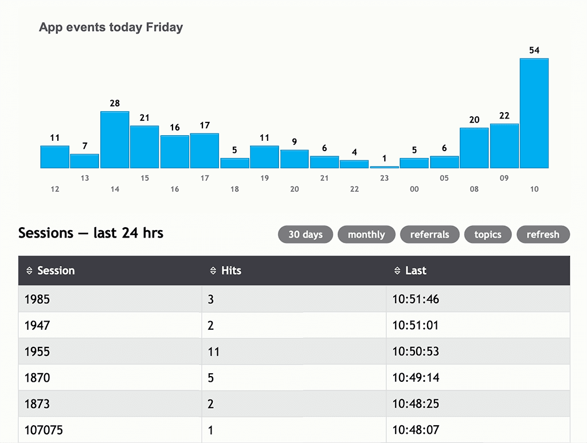

# App Events manager

This project implements a proof-of-concept app events store backend and a statistics dashboard (react) 
to visualize user engagement.



The original motivation was to allow for interactive websites to record and analyze anonymous 
usage data **without** using cookies or tracking software.
[This article](https://hackernoon.com/lets-kill-cookies-my-poc-for-a-less-creepy-way-to-track-engagement) 
describes the approach in detail.

The current implementation is based on a simple LAMP (Linux/Apache/MySQL/PHP) architecture to make 
it deployable on any small or medium site. It would be easy though to replace the backend with a 
cloud based implementation to make it scale-up.

In order to log events, your website or app needs to submit events through `HTTP GET` requests 
to the [backend API](#logging). This is typically done through ajax javascript functions within your website pages, 
or through a suitable logging function in your app. Said functionality is not part of this package, 
nevertheless examples of such scripts are provided below ([see Logging](#logging-events)).


# Backend setup and configuration

## Database

The mysql or mariadb software must be installed on the server before hand. 
The database and its user credentials are created as a first step. 
This is typically done via the mysql admin console (e.g. `phpMyAdmin`). The dbuser requires `CREATE`, `INSERT` and
`SELECT` privileges.  

The db details and access credentials are stored in an `.ini` file in the following format
```
[database] 
servername = localhost 
username = <db_username> 
password = <password> 
dbname = <database_name>
log_table = <table_name_for_event_logging>
```

This file is stored typically in a directory outside the root path of the web server, 
such as to block non-admin access to it. On my hosting service the root path for the site is 
`domains/mydomain.com/public_html/` and the `.ini` files is located under 
`domains/mydomain.com/app-events.ini`  

>**WARNING** This approach to storing db credentials is adequate for website event data but NOT SAFE for any sensitive data.
Also, DO NOT share one and the same database (and dbuser) for logging and other data you may store as part of your 
website functionality. 

Only one table is needed to record app events. The name of the table is defined in the database `.ini` file. The table is created
as part of the [installation](#installation).

The database requires about 75MB storage space for 1 million records (events).

## API configuration

The backend API is configured via `public/config.php`. 
``` 
<?php
mb_internal_encoding("UTF-8");
date_default_timezone_set ("Europe/Amsterdam");
setlocale(LC_TIME, 'en_NL');

// App wide constants
define('STATS_DB_DEV_INI', "../private/app-events.ini");
define('STATS_DB_PROD_INI', "../../app-events.ini");
define('STATS_SITE', "mydomain.com");

// Don't change beyond here
define('STATS_LOCK', true);

// Connect to the database
require_once('db.php');
$db = db_connect();
``` 
`STATS_DB_PROD_INI` points to the locaion of the database `.ini` file, 
`STATS_DB_DEV_INI` for the same file in a development environment.

## Logging events

The logging API consist of a single entry point, defined as follows

```
log.php?log=[event name: String]&r=[referral: String, optional]&l=[landing page: String, optional]
```

Referral and landing are optional.  

**Example 1**  — A logging request signaling the homepage has been reached can be created with a 
script snippet like this
```
<script>
  const ref = encodeURIComponent(document.referrer);
  const landing = encodeURIComponent(window.location.href);
  fetch('app-events/log.php?log=homepage&r=${ref}&l=${landing}');
</script>
```
provided the package has been deployed on a subdirectory `/app-events/` under the website doc root.
No need to read any response, as the the log API returns nothing.

**Example 2** — Signaling "contact me" button results 
```
<script>
  const contactEvent = () => {
    // contact me 
    if(!confirm("Would you like to open your mail client?")){
          fetch('app-events/log.php?log=contact-nok');
          return false;
    } 
    fetch('app-events/log.php?log=contact-ok');
  }
</script>

...

<a href="mailto:me@mydomain.com?subject=Please contact me" onclick="contactEvent()">Contact me</a>
```

## Required backend software

The minimum versions required for the backend are  
>`MariaDB Server version: 10.3.24-MariaDB-cll-lve`  
>`PHP version: 5.5.38`

# Installation

Clone this repo.  

Follow the database creation instructions and API config [as described above](#database).  

Edit the file `public/config.js` and replace `<site_name>` with a name for your website or app (this name appears in the dashboard). 

```
% cd <app-events-download-path>
% yarn install
% yarn build
```
Create a subdirectory `app-events` under your public html website document root.  

Upload the contents of the `build/` subdirectory to `app-events`  

Create the log table by calling up once `https://yourwebsite.com/app-events/model.php`. If everything is configured properly,
you should get a success message as result. Upon success, the App Events manager is ready to work. 

Update your html pages or app to start submitting events ([see Logging above](#logging-events)).

Open the dashboard `https://yourwebsite.com/app-events/` on a web broswer
and check your results.

Have fun!
